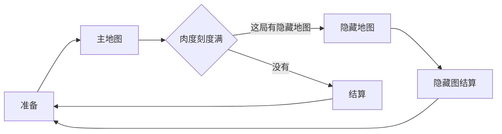
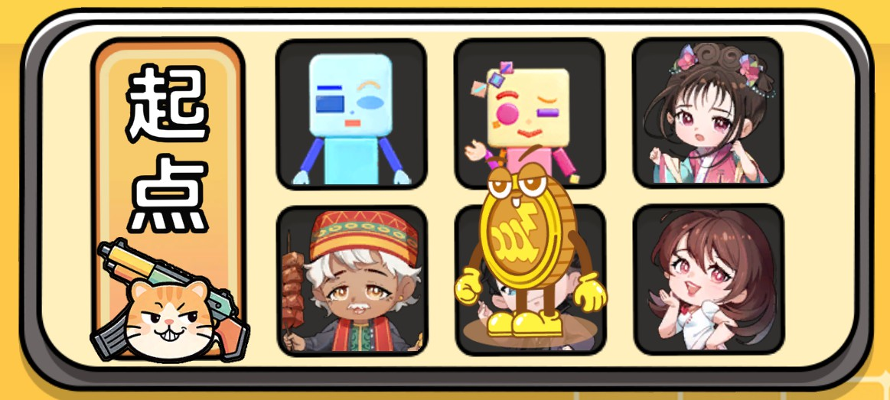
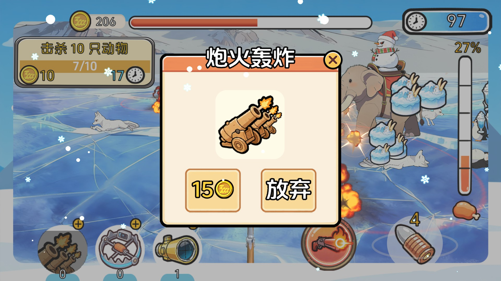
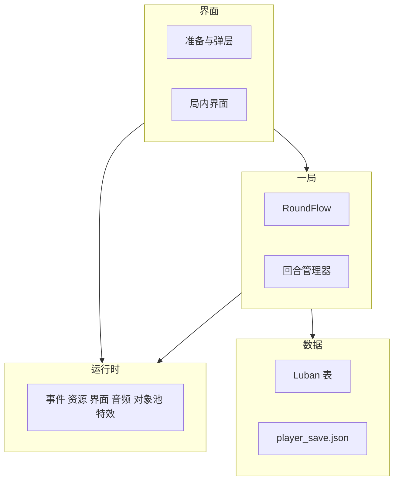
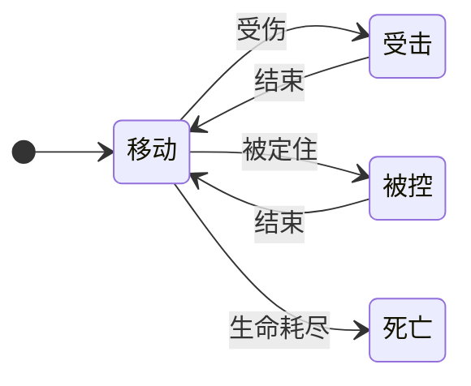

# HuntingClient

游戏名：我给全家打肉吃。准备页掷骰选定角色和技能，幸运仪式页里花金币开宝箱随机摇 Buff。然后进入主地图射击动物、收集食物。肉度刻度满后结算，或者先进入隐藏地图打 Boss 再结算。结算把肉换成金币，回到准备页。

**[展示页](https://greenballyjq.github.io/HuntingClient/)** · 本地打开 [`docs/index.html`](docs/index.html)

## 画面

| 准备 | 主地图 | 隐藏地图 | 结算 |
| --- | --- | --- | --- |
|  |  |  |  |

## 玩法

### 单局流程

进入主地图时按概率决定这局带不带隐藏地图。肉度没满就留在主地图。

### 准备

随机抽一张主地图，显示名称和说明。三千盘金币人站在角色格上。点开始后掷骰走格，停在哪格就是本局角色，并带上该角色绑定的技能。界面会写出角色名、背景故事和技能说明。也可以先开幸运仪式，把抽到的增益带进这一局。

### 主地图

加载森林场景。开场倒计时 8 秒，结束后才能操作，同时播放这张地图的音乐。计时是已经过了多久，到点不会结束这局。

动物按这张地图的物种配置生成。打死之后掉落食物，光效飞到界面对应的位置才入账。肉度涨满一格会提示进度；全部涨满后再倒计时 10 秒，然后结算。如果这局带了隐藏地图，会先弹出进入隐藏地图的提示。

返回按钮会先存档，再回到准备。

### 隐藏地图

加载雪山场景。出场演出结束后 Boss 才开始移动和受击，这时才能操作。倒计时走完停在 0，不会因此结束这局。Boss 倒下后清掉其他还活着的动物；场上没有其余尸体时结算，同时放慢动作。

| | 主地图 | 隐藏地图 |
| --- | --- | --- |
| 场景 | 森林 | 雪山 |
| 时间 | 已用时间 | 倒计时 |
| 动物计数 | 有 | 无 |
| Boss 血条 | 无 | 有 |
| 返回准备 | 有 | 无 |
| 肉条、道具、子弹、摇杆、技能 | 有 | 有 |

### 结算

普通结算用这一张地图上的肉。隐藏图结算把各张图的肉加在一起。肉按汇率换成金币。数字走完才能领取。领取后存档，回到准备页。

### 角色

准备页写出角色名和背景故事。角色是小蓝人、小红人、格格、大美丽、金状元、亚克东。

### 掉落

| 掉落 | 金光粒子飞到哪 | 然后 |
| --- | --- | --- |
| 肉 | 肉条 | 增加肉度 |
| 能量 | 技能 | 增加能量 |
| 子弹 | 子弹图标 | 换成一条特殊子弹 |
| 金币 | 金币图标 | 增加持有的金币 |

### 操作与子弹

手指或鼠标拖动摇杆 UI 拨方向，按住即射击；手指或鼠标在屏幕上滑动，按住也能射击；道具「指哪打哪」会改成点选一只动物，再按提前量（预判）转向射击。两条路都由玩家武器开火。

爆炸弹打中后，落点半径内的动物受到同一次伤害。普通弹、高伤弹、高速弹都只扣打中的那一只。特殊子弹持续时间结束后，回到普通子弹。

### 道具

局内点加号会暂停，同时打开购买层。价格用金币支付。每种道具同时只能用一个，用掉就扣 1 个。

| 道具 | 效果 |
| --- | --- |
| 炮火轰炸 | 在场上落几个点，按间隔伤害动物 |
| 指哪打哪 | 改成点选动物后再射击 |
| 智能诱捕陷阱 | 分批放夹子，把非 Boss 引过来并伤害它 |

### 技能与能量

能量随时间上涨，打死动物掉落的能量也会加。攒满一条再点技能，消耗一条。这一局用哪个技能，由准备页选定的角色决定。

| 角色对应的技能 | 效果 |
| --- | --- |
| 色块人 | 提高自己武器的射速和伤害 |
| 格格 | 身侧生成会自己射击的武器 |
| 大美丽 | 范围内的动物受伤并被定住 |
| 金状元 | 按间隔直接加肉 |
| 亚克东 | 从画面四角放出金币怪，依次跑进场景 |

### 局内动态随机任务

开局过一段时间派出一条，完成或超时后过一段时间再派下一条。

| 任务 | 怎么算完成 |
| --- | --- |
| 狩猎 | 打死足够数量的动物 |
| 收集 | 收集足够数量的肉 |
| 消耗 | 用了技能或道具 |

### 幸运仪式

准备页打开。开礼包后得到一条增益，带进随后这一局。

| 增益 | 效果 |
| --- | --- |
| 更多大肉 | 掉落肉时按概率加量 |
| 开局能量 | 进局时多一段能量 |
| 伤害提升 | 武器和技能的伤害提高 |
| 高阶生成 | 大型动物、弹药怪、金币怪这三类的生成权重乘上配置里的倍数 |

## 架构

### 模块依赖

箭头表示调用方向。界面调用这一局，也直接调用运行时。这一局读表、写存档。

### 运行时

`GameFrameworkManager` 按顺序建好事件、资源、对象池、界面、音频、特效。`HuntingAppFlow` 再挂上配置、存档、玩家数据、输入、相机和转场。

资源从 `ResourceManager` 进。场景换成下一张时走场景管理器，不经过资源加载器。音频分两路：音效占槽位，音乐用三个声部。界面分成页面、抬头、固定、弹层、遮罩，同一种界面同时只开一个。

### 转场与局状态

每次换阶段都先盖上加载层，卸掉现在这阶段，加载下一阶段，再揭开。

| 去向 | 发生的事 |
| --- | --- |
| 准备 | 结束正在进行的一局，打开准备页 |
| 主地图 | 关掉准备页，加载森林，预热要用的预制体，开始这一局 |
| 隐藏地图 | 关掉进入提示，卸掉主地图上的动物和子弹，加载雪山 |

一局里只有「进行中」会推动地图规则和管理器。买道具时会暂停。

### 生成、命中与数值

生成点算出要生什么，管理器从对象池里取出动物。子弹命中时把已经算好的伤害交给生命，不再算一遍。幸运和一部分技能改的是数值层：伤害、射速、掉落、生成权重、肉、能量、结算。

### 动物状态

死亡之后先播死亡，再掉落，然后回收。Boss 在出场演出结束前停着，死亡后不走这次回收。

### 事件

动物、Boss、子弹、能量、肉条、道具、任务、技能、回合、准备、玩家数据，各自有一组事件。界面和管理器订阅这些事件来更新。

## 主要代码

### 启动、存档与转场

| 文件 | 内容 |
| --- | --- |
| [`HuntingAppFlow.cs`](Assets/Scripts/CoreGameLogic/Game/HuntingAppFlow.cs) | 准备、主地图、隐藏地图 |
| [`TransitionGate.cs`](Assets/Scripts/CoreGameLogic/Managers/AppManagers/TransitionGate.cs) | 加载层盖上和揭开 |
| [`SaveService.cs`](Assets/Scripts/CoreGameLogic/Managers/AppManagers/SaveService.cs) | `player_save.json` |
| [`PlayerDataManager.cs`](Assets/Scripts/CoreGameLogic/Managers/AppManagers/PlayerDataManager.cs) | 金币、道具、完局数、格子 |

### 回合与模式

| 文件 | 内容 |
| --- | --- |
| [`RoundFlow.cs`](Assets/Scripts/CoreGameLogic/Game/Round/RoundFlow.cs) | 一局的进行、暂停、换图 |
| [`MainMapMode.cs`](Assets/Scripts/CoreGameLogic/Game/Round/Modes/MainMapMode.cs) | 主地图时间，肉度满了去哪 |
| [`HiddenMapMode.cs`](Assets/Scripts/CoreGameLogic/Game/Round/Modes/HiddenMapMode.cs) | 隐藏地图的 Boss 和结束 |

### 肉条、能量与结算

| 文件 | 内容 |
| --- | --- |
| [`MeatProgressManager.cs`](Assets/Scripts/CoreGameLogic/Managers/RoundManagers/MeatProgressManager.cs) | 肉度和刻度 |
| [`EnergyProgressManager.cs`](Assets/Scripts/CoreGameLogic/Managers/RoundManagers/EnergyProgressManager.cs) | 能量条 |
| [`SettlementManager.cs`](Assets/Scripts/CoreGameLogic/Managers/RoundManagers/SettlementManager.cs) | 肉换成金币 |

### 动物、生成与武器

| 文件 | 内容 |
| --- | --- |
| [`BaseAnimalBehaviour.cs`](Assets/Scripts/CoreGameLogic/Game/Round/AnimalRefactor/AnimalBehaviour/BaseAnimalBehaviour.cs) | 生命、移动、状态 |
| [`BossAnimalBehaviour.cs`](Assets/Scripts/CoreGameLogic/Game/Round/AnimalRefactor/AnimalBehaviour/BossAnimalBehaviour.cs) | Boss 出场和死亡 |
| [`SpawnerManager.cs`](Assets/Scripts/CoreGameLogic/Managers/RoundManagers/SpawnerManager.cs) | 按地图生成 |
| [`PlayerWeapon.cs`](Assets/Scripts/CoreGameLogic/Game/Round/Weapons/PlayerWeapon.cs) | 玩家射击 |
| [`SkillWeapon.cs`](Assets/Scripts/CoreGameLogic/Game/Round/Weapons/SkillWeapon.cs) | 自动锁定 |

### 操作与子弹

| 文件 | 内容 |
| --- | --- |
| [`InputManager.cs`](Assets/Scripts/CoreGameLogic/Managers/AppManagers/InputManager.cs) | 按住射击、点选目标 |
| [`PlayerControlManager.cs`](Assets/Scripts/CoreGameLogic/Managers/RoundManagers/PlayerControlManager.cs) | 摇杆和辅助瞄准切换 |
| [`BulletBehavior.cs`](Assets/Scripts/CoreGameLogic/Game/Round/Bullets/BulletBehavior.cs) | 飞行和命中 |
| [`RoundNumericLayer.cs`](Assets/Scripts/CoreGameLogic/Game/Round/Numeric/RoundNumericLayer.cs) | 局内数值 |

### 道具、技能、任务与幸运

| 文件 | 内容 |
| --- | --- |
| [`PropManager.cs`](Assets/Scripts/CoreGameLogic/Managers/RoundManagers/PropManager.cs) | 道具开始和结束 |
| [`SkillManager.cs`](Assets/Scripts/CoreGameLogic/Managers/RoundManagers/SkillManager.cs) | 用能量开技能 |
| [`QuestManager.cs`](Assets/Scripts/CoreGameLogic/Managers/RoundManagers/QuestManager.cs) | 派发任务 |
| [`LuckyBuffManager.cs`](Assets/Scripts/CoreGameLogic/Managers/RoundManagers/LuckyBuffManager.cs) | 这一局的幸运增益 |

### 事件

键在 [`Assets/Scripts/CoreGameLogic/Events`](Assets/Scripts/CoreGameLogic/Events)。局内的分在 `RoundEvents`。

### 界面与配表

| 文件 | 内容 |
| --- | --- |
| [`UIPrepare.cs`](Assets/Scripts/CoreGameLogic/UI/Prepare/UIPrepare.cs) | 掷骰、选角、进局 |
| [`UIGameplay.cs`](Assets/Scripts/CoreGameLogic/UI/Gameplay/UIGameplay.cs) | 两张地图上哪些界面元件出现 |
| [`HuntingConfigManager.cs`](Assets/Scripts/CoreGameLogic/Managers/AppManagers/HuntingConfigManager.cs) | 读表 |

表在 [`Assets/Scripts/GameConfig/gen`](Assets/Scripts/GameConfig/gen)，字节在 `Resources/Bundle/Raw/Configs/bytes`。

### 场景空间与提前量

可游玩区域、触发区在 [`Assets/Scripts/Tools`](Assets/Scripts/Tools)。轰炸、陷阱、大美丽的范围用这块区域。技能武器的提前量在 [`Ballistics.cs`](Assets/Scripts/Tools/Math/Ballistics.cs)。

### 运行时模块

[`Assets/GameFramework`](Assets/GameFramework)。玩法用 `GameFrameworkManager` 取事件、资源、对象池、界面、音频和特效。

## 环境

- 编辑器：Unity 2022.3.7f1c1
- 入口：`Assets/Scenes/BootstrapScene.unity`
- 同目录还有准备、森林、雪山

第一次打开会生成 `Library`。UniTask、YooAsset 2.3.14、Input System、UGUI、Luban 写在 `Packages/manifest.json`。
