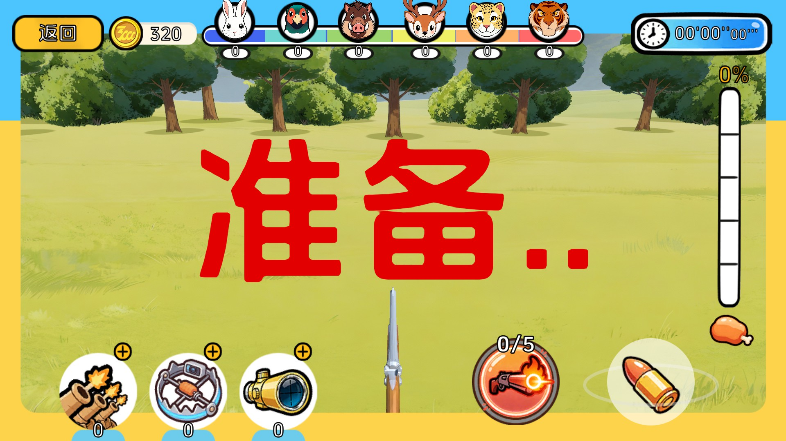
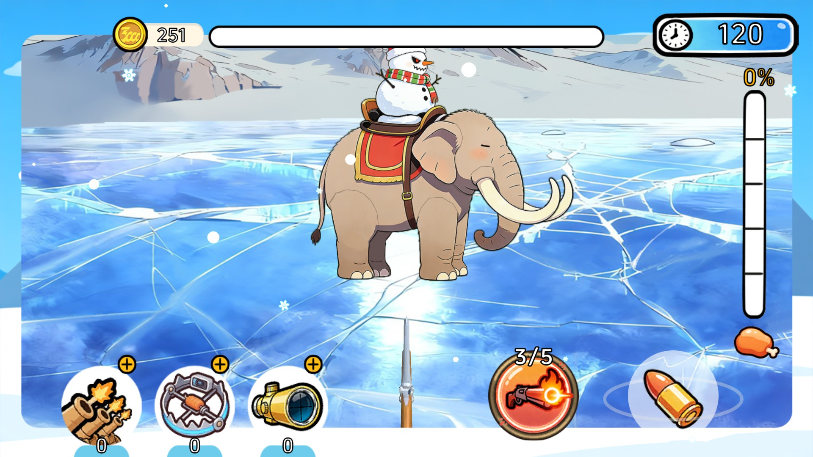
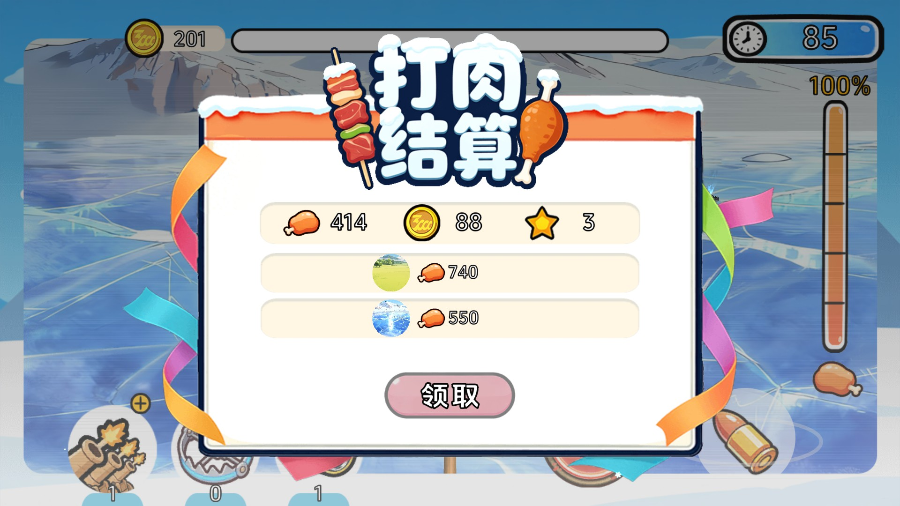
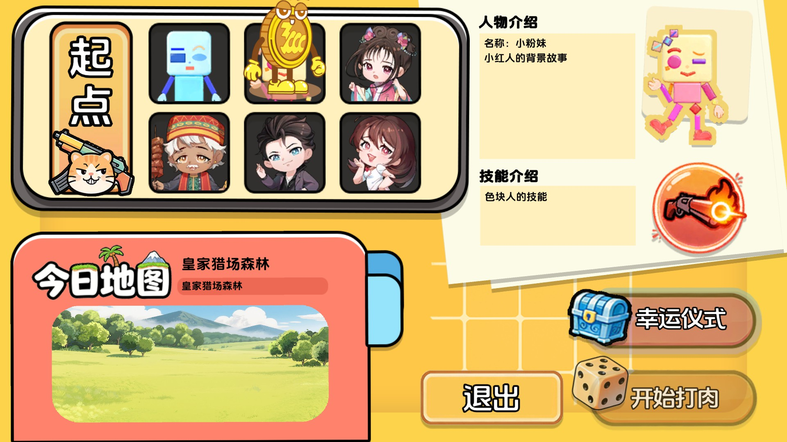
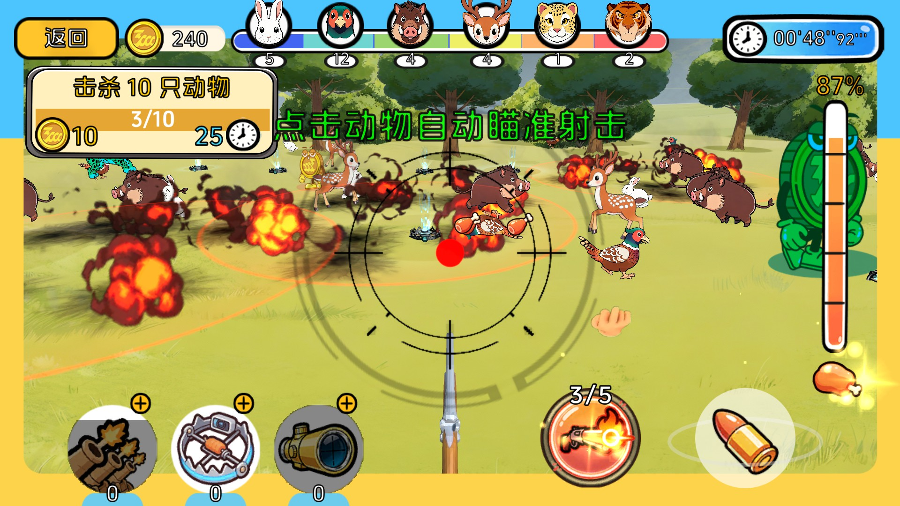
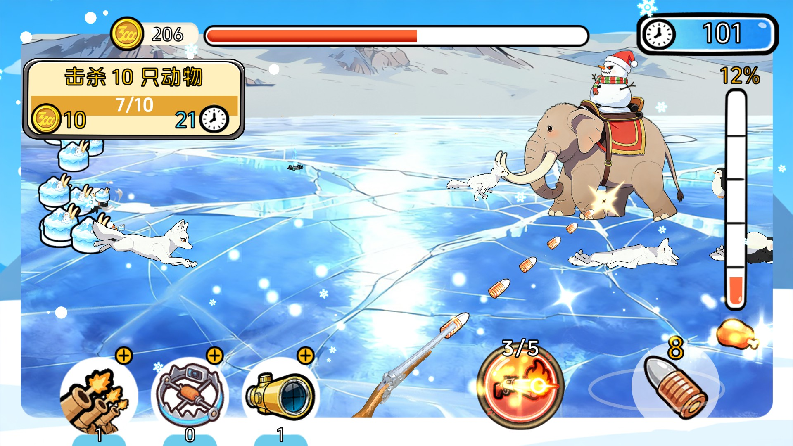
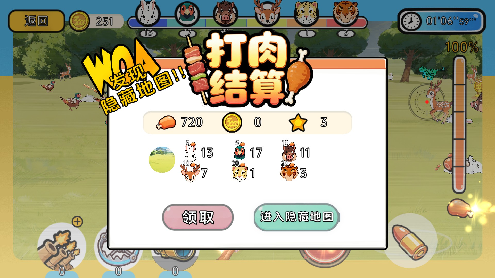

# 我给全家打肉吃

[**首页**](README.md) · [玩法](docs/gameplay.md) · [架构](docs/architecture.md) · [打开与运行](docs/getting-started.md) · [目录导读](docs/project-structure.md)

2D 打猎游戏，使用 Unity 2022.3.7f1c1制作。

单局循环为：准备 → 主地图打猎 → 结算 → 隐藏地图（按概率触发）→ 回到准备。主地图中玩家猎杀动物获得肉，肉条打满即进入结算；隐藏地图为限时战斗。

试玩：https://greenballyjq.itch.io/hunting

## 截图

  
  
  
  

## 玩法概览

### 准备

准备界面随机抽出一张主地图，展示其图标、名称与描述。角色由掷骰决定：金币人在角色格子上按骰子点数行走，落到的格子决定本局角色，角色绑定一个技能；金币人所在格子记入存档，下一局从该格子继续。开打前可进行一次幸运仪式，开礼包获得增益。点"开始"进入单局。

### 主地图

入场播放 8 秒倒计时（5、4、3、2、1、准备..、开始.、战斗!!），随后开始计时。玩家自由猎杀动物，动物掉落肉，肉量按刻度推进肉条；每达成一个刻度提示一次狩猎进度，肉条打满时提示"肉条已满，即将结算！"并播放 10 秒倒计时，随后结算。

单局是否触发隐藏地图，在进入回合时按配置概率随机决定。

### 隐藏地图

结算时若本局触发隐藏地图，会给出进入入口。隐藏地图按固定节拍演出：红光警报与 Boss 警报音 → Boss 登场（吼叫、血量条增长）→ 8 秒战斗倒计时 → 开战。Boss 死亡后清场；场上无存活动物时以 0.3 倍速播放 4 秒慢动作，待尸体消失后结算。

### 结算

结算展示本局狩猎统计。主地图结算后，本局触发隐藏地图的会先给出进入入口，未触发的直接进入普通结算；隐藏地图结束时展示隐藏地图结算。之后回到准备阶段，进入下一局。

## 快速开始

前置条件：

| 项 | 要求 |
|---|---|
| Unity | 2022.3.7f1c1 |
| 第三方库 | `Assets/Plugins` 下的 DOTween 与 Spine **不随仓库分发**，需自行补齐 |
| 资源产物 | `Assets/StreamingAssets/yoo/` **不随仓库分发** |

步骤：

1. 克隆仓库。
2. 补齐 `Assets/Plugins` 下的第三方库：DOTween（Demigiant）、Spine。
3. 以符号链接引用自研框架 GameFramework
4. 用 Unity 2022.3.7f1c1 打开工程，等待首次导入与包还原完成。
5. 打开 `Assets/Scenes/BootstrapScene.unity`，运行。

补齐第三方库与资源产物的方式、以及运行时的常见问题，见 [打开与运行](docs/getting-started.md)。

## 技术构成

### 自研框架

GameFramework 为独立仓库，通过 git 符号链接挂在 `Assets/GameFramework`，本仓库不含其源码。按命名空间划分为六个模块：`GameFramework.Audio`、`GameFramework.Core`、`GameFramework.Game`、`GameFramework.Manager`、`GameFramework.UI`、`GameFramework.Utility`。

框架仓库地址：https://github.com/greenballyjq/GameFrame

### 配表

数值表在独立仓库 HuntingConfig：20 张数据表加 3 张 schema 表，用 Luban 4.2.1 生成 C# 代码与二进制数据。

配表仓库地址：https://github.com/greenballyjq/HuntingConfig

本仓库只含生成结果。代码在 `Assets/Scripts/GameConfig/gen/`（66 个 `.cs`），数据在 `Assets/Resources/Bundle/Raw/Configs/bytes/`（20 个 `.bytes`），运行时用 `Resources.Load` 读取。改数值要在配表仓库改表，生成后把 `output/code`、`output/bytes` 复制回上述两个目录。

### Package Manager 依赖

来自 `Packages/manifest.json`。

| 包 | 版本 / 来源 |
|---|---|
| `com.unity.render-pipelines.universal` | 14.0.8 |
| `com.unity.inputsystem` | 1.6.3 |
| `com.unity.2d.animation` | 9.0.4 |
| `com.unity.2d.sprite` | 1.0.0 |
| `com.unity.textmeshpro` | 3.0.6 |
| `com.unity.postprocessing` | 3.5.0 |
| `com.unity.timeline` | 1.7.5 |
| `com.unity.recorder` | 4.0.1 |
| `com.unity.visualscripting` | 1.8.0 |
| `com.unity.test-framework` | 1.1.33 |
| `com.tuyoogame.yooasset` | 2.3.14（registry: package.openupm.com） |
| `com.cysharp.unitask` | git: `Cysharp/UniTask` |
| `com.code-philosophy.luban` | git: `focus-creative-games/luban_unity` |
| `com.coplaydev.unity-mcp` | git: `CoplayDev/unity-mcp` v10.1.2 |

`com.coplaydev.unity-mcp` 为开发期工具，不参与运行时。

### 不随仓库分发的第三方库

位于 `Assets/Plugins`，被 `.gitignore` 排除。

| 库 | 目录 |
|---|---|
| DOTween | `Assets/Plugins/Demigiant` |
| Spine | `Assets/Plugins/Spine` |

## 仓库结构

| 目录 / 文件 | 内容 |
|---|---|
| `Assets/` | 工程资源：场景、脚本、美术、配置、Plugins、InputSystem、TextMesh Pro 等 |
| `Assets/Scripts/` | 全部游戏脚本，分 `CoreGameLogic`、`GameConfig`、`Tools` 三块 |
| `Assets/Scenes/` | 4 个场景，见下表 |
| `Packages/` | 包依赖清单 |
| `ProjectSettings/` | 工程设置 |
| `docs/` | 文档与配图 |

脚本规模（统计范围 `Assets/Scripts`，行数含空行、注释与括号）：

| 分块 | `.cs` 文件 | 行数 |
|---|---|---|
| `CoreGameLogic` | 180 | 18313 |
| `GameConfig` | 74 | 4483 |
| `Tools` | 13 | 1596 |
| 合计 | 267 | 24392 |

场景（`ProjectSettings/EditorBuildSettings.asset` 中的顺序，第 1 个为运行起点）：

| 场景 | 用途 |
|---|---|
| `BootstrapScene` | 运行起点 |
| `PrepareScene` | 准备阶段 |
| `GameplayForestScene` | 主地图 |
| `GameplaySnowMountainScene` | 隐藏地图 |

## 文档

| 文档 | 内容 |
|---|---|
| [玩法](docs/gameplay.md) | 一局的完整过程，以及局内各系统的规则 |
| [架构](docs/architecture.md) | 与框架的边界、分层、启动链路、设计取舍 |
| [打开与运行](docs/getting-started.md) | 环境要求、补齐缺失内容、运行、常见问题 |
| [目录导读](docs/project-structure.md) | 各目录职责，以及想改某处该去哪个文件 |

## 当前限制

- `Assets/Plugins` 下的第三方库（DOTween、Spine）不随仓库分发，克隆后需自行补齐才能编译。
- 资源打包产物（`Assets/StreamingAssets/yoo/`）不随仓库分发。
- GameFramework 以符号链接引用，源码不在本仓库。
