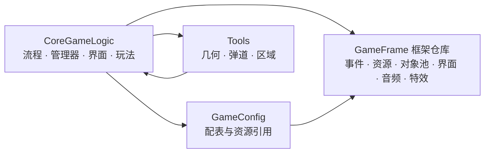
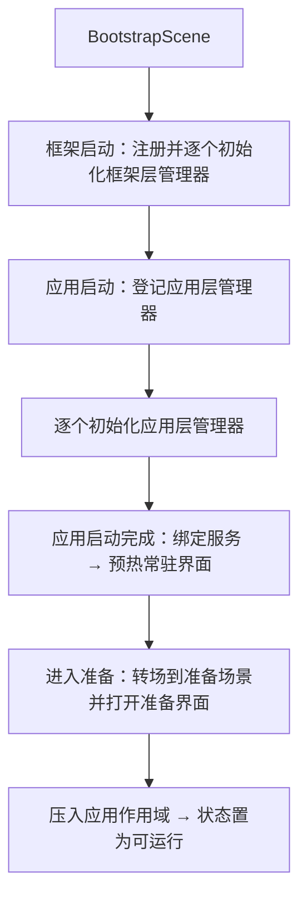
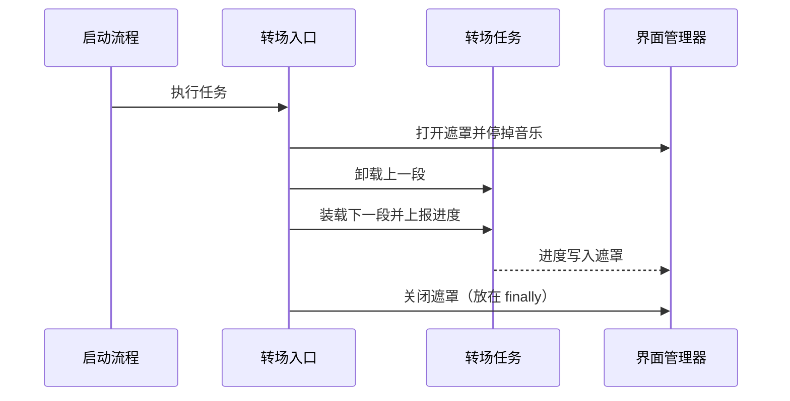

# 架构

本篇说明工程内部的结构：代码分成哪几块、各块之间怎么依赖、从哪里启动、一局怎么跑起来，以及几处结构选择为什么这么定。读者是要在这个工程上继续开发的人。要查某个功能落在哪个文件，见 [目录导读](project-structure.md)。

## 与框架仓库的边界

本仓库是游戏侧。框架 GameFramework 是独立仓库，以符号链接挂在 `Assets/GameFramework`，本仓库不含它的源码。

依赖是单向的：游戏引用框架，框架不引用游戏的任何类型。因此框架可以直接搬进别的工程，游戏侧换掉框架也不需要动框架。框架提供的能力是：单例与生命周期、事件、资源与场景加载、对象池、界面与分层、音频、特效。

工程与框架编在同一个程序集里（除 Plugins 外没有程序集定义文件），这条边界靠目录和命名空间维持。把游戏类型写进框架代码不会编译报错，但会让框架不再能独立复用——这是这条边界唯一需要人工守的地方。

## 三层管理器

管理器分三层，各层有自己的宿主，各层只放该层寿命的东西。

| 层 | 宿主 | 管什么 |
|---|---|---|
| 框架层 | 框架的启动组件 | 事件、资源、对象池、界面、音频、特效 |
| 应用层 | 本工程的启动流程 | 配置、存档、玩家数据、输入、相机、转场 |
| 单局层 | 每局新建的回合流程 | 一局内的实体与规则：武器、动物、场景物件、肉条、能量、任务、结算、刷怪、陷阱、增益、操作、道具、子弹、技能 |

三层各有取用入口，工程内不直接构造管理器。新增管理器先判断它属于哪一层：跨局存活、随应用启动一次的放应用层；随局创建和销毁的放单局层。放错层的后果是寿命不对——单局层的东西放进应用层，会带着上一局的状态进下一局。

## 代码分区与依赖方向

`Assets/Scripts` 分三块，按用途划分：

| 分块 | 职责 |
|---|---|
| `CoreGameLogic` | 流程、管理器、界面、以及一局内的玩法系统 |
| `GameConfig` | 配表生成的表类型与资源引用表 |
| `Tools` | 与玩法无关的几何形状、弹道计算、区域触发器 |

块之间的依赖：

- 玩法引用配表的生成类型；
- 玩法引用工具；工具下的区域触发器反过来引用动物类型，两块互相引用；
- 配表是叶子，不被其它两块引用。

分区是按用途分的，不是严格分层，所以有两个方向的引用。工具反向依赖玩法的那一处（区域触发器要知道动物是谁）是工具不能单独搬走的原因；再加工具时不要把玩法类型带进去。

## 启动与一局运转

启动从 `BootstrapScene` 开始，到准备界面为止：

框架层与应用层的管理器都按登记顺序逐个初始化，前一个完成才开始下一个。应用有四个状态：未启动、启动中、运行中、退出中，只有运行中每帧驱动更新；退出时逆序释放应用层管理器，释放前写一次存档。

启动完成后进入准备界面，等待玩家开始一局。一局结束再回到准备，不再走一遍启动。

## 转场与回合

### 转场

切换场景与界面都走同一个入口，它是工程内唯一允许开关加载遮罩的地方。一次转场分覆盖、卸载上一段、装载下一段、揭幕四步，揭幕放在 `finally` 里，装载过程中出异常也会揭幕。

三种转场各有一个任务对象：回准备、进主地图回合、进隐藏地图回合。新增一种转场要新增一个任务对象，不能就地写加载逻辑。

### 回合

回合流程每局新建，进入顺序固定：压入回合作用域 → 登记并逐个初始化回合管理器 → 打开任务界面 → 进入主地图模式。

结束按相反的顺序回收：清规则 → 结束当前模式 → 解绑场景物件 → 逆序释放回合管理器 → 清空特效与对象池 → 关闭本局界面 → 弹出回合作用域。

一局内换图（主地图切隐藏地图）也在这个流程里：结束当前模式 → 解绑场景物件 → 卸载运行时资源 → 加载隐藏地图场景 → 重新绑定场景物件 → 进入隐藏地图模式。

场景与地图的对应写在回合的加载清单里：主地图用森林场景，隐藏地图用雪山场景。

## 关键设计取舍

### 转场收口到单一入口

- 问题：进准备、进回合、进隐藏地图都要加载场景、切换界面、处理音乐。各处各写一套，容易出现遮罩没关、音乐重叠、卸载漏项。
- 做法：加载遮罩只在转场入口内开关，三处转场各自只提供一个任务对象。
- 代价：新增转场必须实现一个任务对象，不能就地写加载逻辑。

### 玩法规则按类型注入，不对流程做分支

- 问题：主地图与隐藏地图共用同一套回合流程，但计时方向、界面该显示哪些部件都不同。
- 做法：回合流程持有一张按类型索引的规则表，模式进入时把计时规则和界面可见性规则的实现写进去，流程只向规则表取值。
- 代价：规则以类型为键，同一类型只能有一份；规则之间的依赖不由编译器检查。

### 回合管理器按能力接口分派

- 问题：一局内的管理器需要的能力不一样，有的要每帧更新，有的要随暂停停住，有的要随场景绑定和解绑。
- 做法：登记时按能力接口归到几个列表，流程只遍历对应的列表。
- 代价：新增一类能力要在回合流程里加一个列表和一段遍历。

### 事件订阅与资源加载共用作用域

- 问题：一局内产生的订阅与加载，若逐处手工释放，容易在转场时漏到下一局。
- 做法：作用域只有应用与回合两个值。应用启动时压入应用作用域，进回合时压入回合作用域，回合结束时弹出一次，作用域内的订阅随之回收。
- 代价：作用域是栈式的压入与弹出，嵌套层级增加时要相应增加配对操作。

### 数值修改按口分家

- 问题：伤害、射速、掉落、刷怪、肉与能量的发放、结算、生命上限、技能能耗都会受效果影响。在计算处堆条件分支，分支数会随效果来源增长。
- 做法：每类各有一个修正口，回合的数值层按类别持有一组修正项，求值时按登记顺序链式传递；登记返回句柄，效果结束时注销。
- 代价：只对已支持的量生效；新增一个可被修改的量，要加一个修正口与一组登记、注销、求值方法。

### 资源加载留了接缝

- 问题：编辑器里读工程内资源、出包后读资源包，两套读法若散在业务代码里，换方案要动很多处。
- 做法：加载由接口约定，框架提供两个实现，工程在启动场景上选一个。
- 代价：业务只认接口，不能依赖某个实现的专有加载方式。
