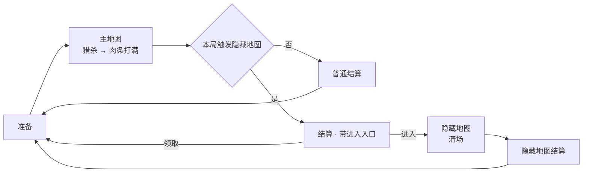
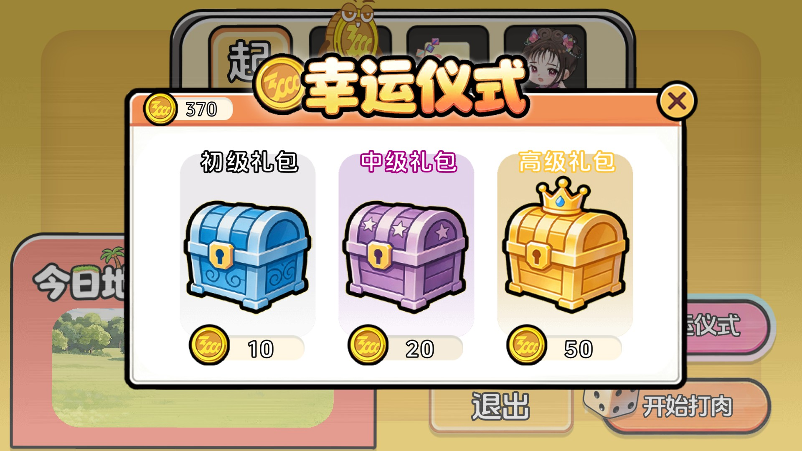
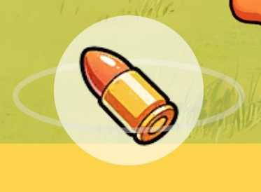
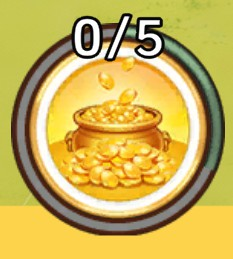
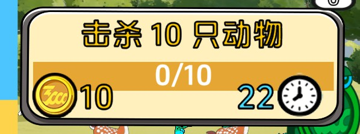

# 玩法

[首页](../README.md) · [**玩法**](gameplay.md) · [架构](architecture.md) · [打开与运行](getting-started.md) · [目录导读](project-structure.md)

本篇说明这款游戏的规则：一局从头到尾会发生什么，每一步由什么推动，什么条件下会出现什么结果。具体数值在配表里，本篇讲数值的作用，不搬数值本身。

## 一局是怎么走的

一局分三段：准备、主地图、结算。主地图结束后，本局可能多出一段隐藏地图；隐藏地图结束要再结算一次。两种结算都回到准备，开始下一局。

是否触发隐藏地图在开局时就已定下，进入主地图后不再改变。

## 准备

准备阶段做三件事：定地图、定角色、开幸运仪式。

**定地图。** 从主地图中随机抽一张，界面上显示它的名称、描述和图标。一局只跑这一张。

**定角色。** 界面上有一排角色格，格上有一个棋子。棋子从上次的落点出发，按掷出的点数往前走，走到哪一格就取哪一格的角色。棋子落点记入存档，下一局从那里继续；没有存档记录时从第一格起算。

每个角色绑定一个技能。角色定下来后，界面显示该角色的档案和它的技能说明。

**开幸运仪式。** 花金币开一个礼包，随机得到一个增益。增益在随后开始的这一局里生效，不会留到下一局。

准备界面上还有一个退出按钮，直接关闭游戏。

## 主地图

进入主地图先有一段开场倒计时演出，演出期间界面不能操作；演完开始计时，并播放本地图的环境音与音乐。

**计时只是显示。** 主地图的计时是累计走过的时长，没有上限，也不会因为时间到而结束。结束主地图的条件只有一个：肉条打满。

**肉条与狩猎进度。** 玩家自由猎杀动物，动物掉的肉推进肉条。肉条分成若干刻度：每满一个刻度，界面提示一次狩猎进度；全部刻度打满时，先提示肉条已满，再播一段倒计时，然后进入结算。

**结算入口。** 本局触发了隐藏地图时，先进到一个带进入入口的结算界面；没有触发就直接进普通结算。

主地图界面上有返回按钮，点了立刻存档并回到准备，本局作废。

## 动物与掉落

动物按体型分成小、中、大三类，另有专门掉弹药的、专门掉金币的，以及 Boss。中小大三类的击杀数会显示在主地图界面上。

动物有生命值，被子弹、技能或陷阱打掉就进入死亡。死亡分两段：先原地留下尸体，过一会掉出奖励，再过一会尸体消失。

掉落有四类，去向各不相同：

| 掉落 | 去向 |
|---|---|
| 肉 | 推进肉条 |
| 能量 | 补充能量条 |
| 金币 | 进入携带的金币 |
| 弹药 | 玩家武器换成一把特殊子弹，持续一段时间后换回普通子弹 |

奖励会自己飞到界面上对应的位置，不需要走过去捡。

动物不会反击，只有动物有生命值，玩家不会受伤。场上的动物由场景里的刷怪点持续放出，放出什么、按什么比例，随地图配置。

## 隐藏地图

隐藏地图是一段独立的限时战斗，要在结算界面上主动点进入才会开始。

进入后先走一段固定演出：红光警报 → Boss 登场并吼叫 → Boss 血量条增长 → 战斗倒计时。演出期间不能操作，演完才开战。

开战后的规则：

- 界面上有倒计时，但倒计时归零不会结束战斗。胜负只看场上还有没有动物。
- Boss 每隔一段时间把附近的动物叫成守卫，让它们绕着自己聚集；过一会这些动物改回原来的走法。
- 场上活着的动物太多时，刷怪暂停；数量降下来再恢复。
- Boss 死的时候，其余活着的动物一起死。

场上所有动物连同尸体都清完之后，播一段慢动作，然后进入隐藏地图结算。

隐藏地图界面上不显示动物击杀数和返回按钮，改为显示 Boss 血量。

## 结算

结算把本局攒下的肉折算成奖励：

- 肉量取本局各张地图的累计值，按固定汇率换成金币，另算一份积分。
- 折算先过一遍增益，有的增益能把奖励整体乘倍。
- 界面按体型列出击杀数；隐藏地图结算还会按地图列出每张地图贡献了多少肉。
- 统计数字播完动画，「领取」按钮才可点。

点「领取」才真正写入存档：金币入账、完成局数加一、回到准备。

换算里那份积分目前没有地方保存，界面上也不显示。

## 局内系统

### 操作

玩家不移动，只改变武器的朝向。默认用摇杆：左右推摇杆改变射击角度，摇杆一旦被推动就持续开火；按住指针左右拖动也能转方向。

个别玩法会把操作切成点选瞄准：点中一只动物后，自动按这只动物的移动提前量瞄准并连续开火；目标跑出视野、超出距离或者死掉，就换场上最近的另一只。

### 能量与技能

能量随时间自己增长，掉落的能量也能补。攒够一条能量才能放技能。

技能由角色绑定，放一次消耗一条能量，持续一段时间。

| 技能 | 效果 |
|---|---|
| 色块人 | 一段时间内提高玩家武器的射速与伤害 |
| 紫薇 | 在玩家左右两侧生成会自动索敌开火的武器 |
| 大美丽 | 对场上动物打一次范围伤害，并把它们定在原地一段时间 |
| 金状元 | 一段时间内分几次直接送肉量 |
| 亚克东 | 一段时间内从屏幕外分几次放出金币人，走向场内 |

### 道具

道具分三种，各有存量，也能在局内花金币买。同一种道具正在用时不能再放；放一次扣一个，并进入与持续时间等长的冷却。

| 道具 | 效果 |
|---|---|
| 炮火轰炸 | 在可游玩区域内落下一片轰炸区，按间隔反复结算伤害 |
| 瞄准镜 | 一段时间内把操作切成点选瞄准 |
| 陷阱 | 一段时间内陆续在场上丢陷阱；陷阱把附近动物吸过来，夹住后造成伤害 |

炮火轰炸与陷阱的伤害不受技能和增益影响。

### 任务

任务由系统按自己的节奏随机派发，同一时刻只有一个。到时间没做完就消失，做完直接给金币。

| 类型 | 目标 |
|---|---|
| 狩猎 | 打死够数量的动物 |
| 收集 | 收到够数量的肉 |
| 消耗 | 用够次数的技能或道具 |

### 幸运增益

| 增益 | 效果 |
|---|---|
| 更多大肉 | 掉肉时按概率多掉一份 |
| 开局能量 | 开局直接送若干条能量 |
| 伤害提升 | 提高武器与技能的伤害 |
| 高阶派发 | 更容易刷出大体型、弹药型和金币型的动物 |
